Pixelorama aims for a simplistic and understandable, yet professional User Interface (from now on referred as UI). Optimized for quick access to everything, Pixelorama's UI looks like this:

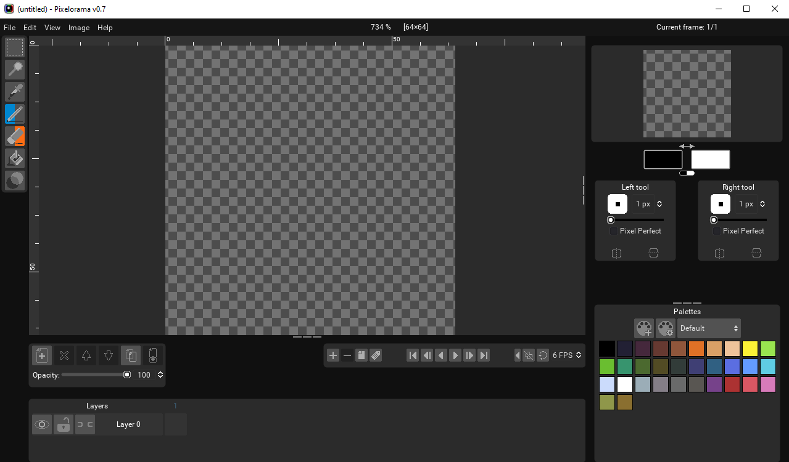

##### Note that the image above is the default look of Pixelorama (Dark Theme) after you have closed the splash screen.

Now, let's categorize the common elements of which the UI is consisted of and give everything a short description.

## The Canvas

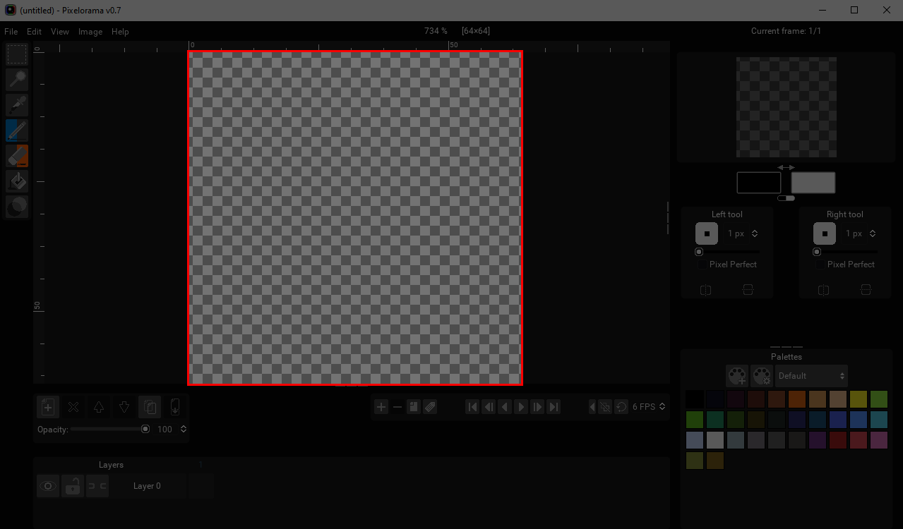

Located in the middle of your view, the canvas is the "sheet" on which you are creating your artwork. The default canvas is a transparent 64x64 pixels.

## The Canvas Rulers

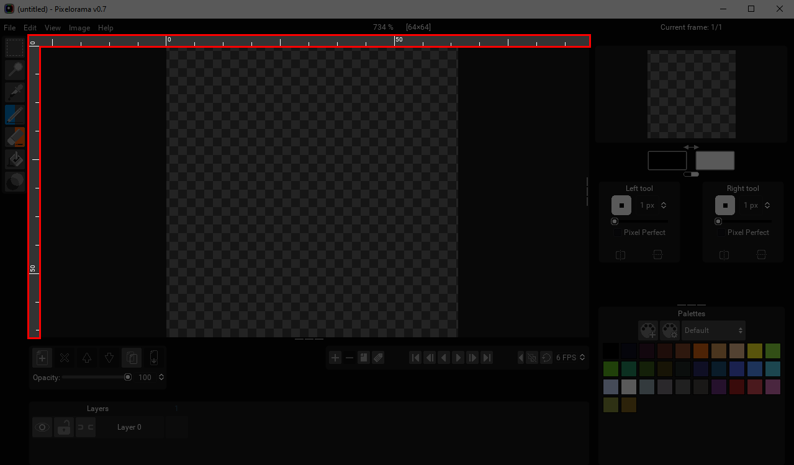

Around the canvas you can locate the canvas rulers. They basically work like normal rulers, measuring length in pixels. There is a vertical and a horizontal one and by left-clicking one of them and dragging your cursor towards the canvas you can add guides.

## The Top Menu Bar

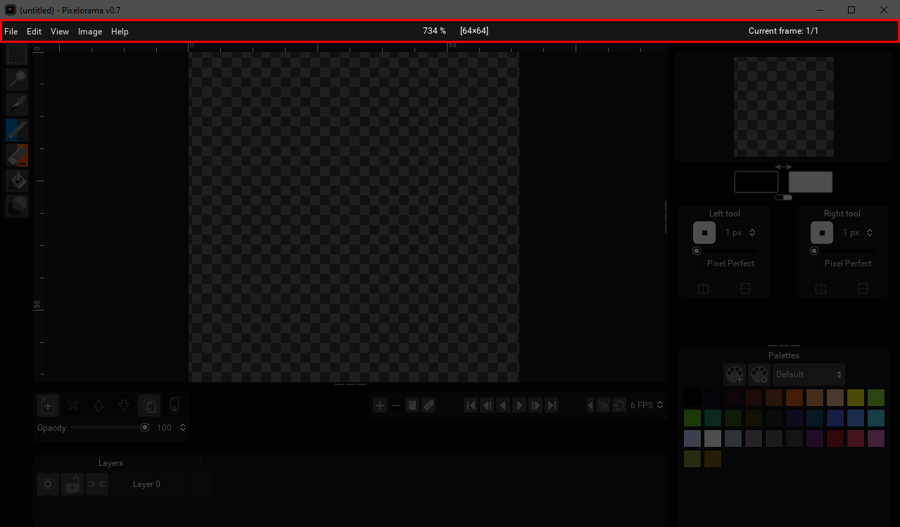

Located at the top of the UI, the top menu bar consists of the following menus:

- File
- Edit
- View
- Image
- Help 

##### Each menu has its own options that will be analyzed further at their own documentation page.

In the middle of this bar, you can also see the exact % of the canvas zoom, the canvas size and if your mouse cursor is located in the canvas, it will show you the exact coordinates of your cursor's position relative to the canvas. On the right you can see what your selected frame is out of the total frames you have created.

## The Toolbar

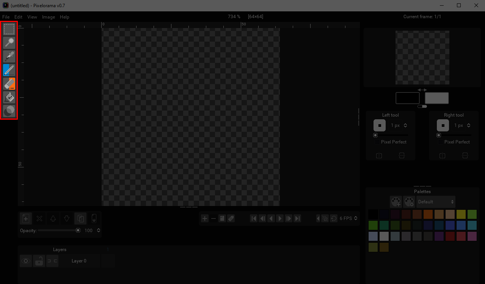

Located on the left, this is where you can select a tool to use. Left clicking a tool will assign this tool to your left mouse click and right clicking it will assign the tool you clicked to your right click. 

##### By default the left click is assigned to the brush tool and the right click is assigned to the eraser tool.

## The Layer Options

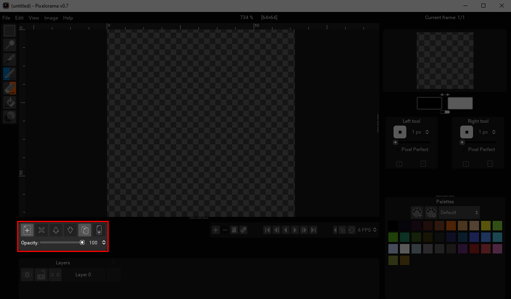

Located down and left as indicated on the image, this is where you can find all of your layer options. 

##### Since by default there is only one layer, you can press the "Add layer" and "Clone Layer" buttons, while the "Delete Layer", "Move layer up/down" and "Merge layer down" buttons are disabled until more layers are added.

## The Timeline Options

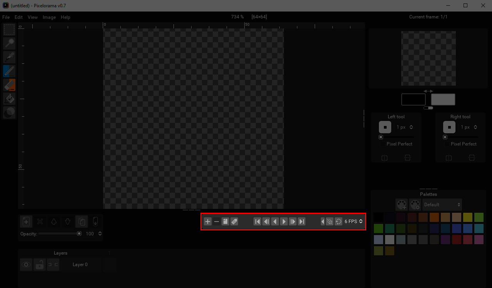

On the right of the layer options, there is another set of buttons called the timeline options. The timeline options is especially useful for animators, since they have the ability to add, remove, clone layers, add animation tags, playback the animations they made, change the speed, use onion skinning etc. 

##### Note that since by default there is only one frame until you add more, the "Remove Frame" button is disabled (you cannot have less than one frames).

## The Timeline

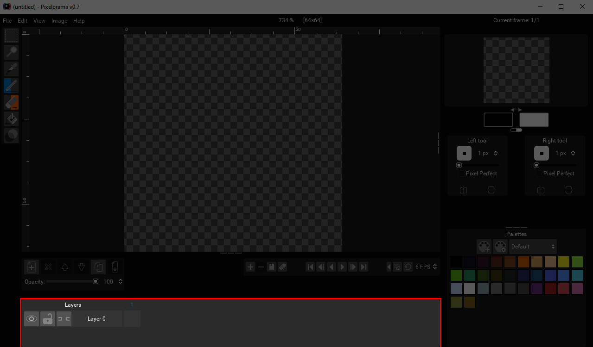

The timeline is where the effects of the timeline options and layer options take place. You can select the exact layer and frame you want and edit it accordingly. There are 3 more buttons here, the visibility, lock and link buttons. Note that from now on we will be referring to the squares of the timeline (meaning that specific frame of a specific layer) as cels.

##### By default there is only one cel visible, meaning you have one layer (layer 0) and one frame (frame 1)

## The Canvas Preview

There are currently two ways to preview your canvas with Pixelorama.

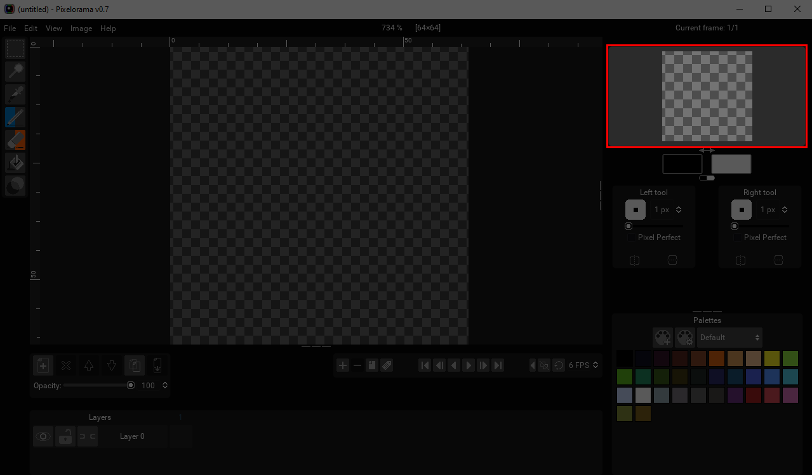

The first preview is pretty straightforward, located on the top right of the UI as seen above. 

For the second preview you need to drag the grabber indicated in the picture to the left (it is not visible by default). This will make another canvas appear, which can only be used for viewing purposes (you cannot draw or edit this canvas, only the original one).

## The Selected Colors

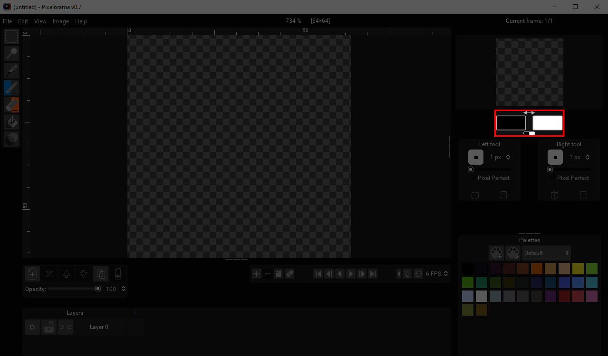

Located right underneath the canvas preview, the selected colors are the colors used by the left and right tools. 

## The Left and Right Tool Options

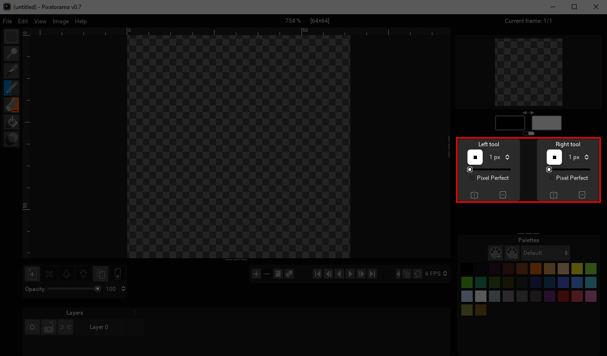

Under the selected colors, you can see the left and right tool options. The options correspond to the selected tools from the toolbar.

##### By default, the left tool options are referring to the brush tool and the right tool options are referring to the eraser.

## The Palettes

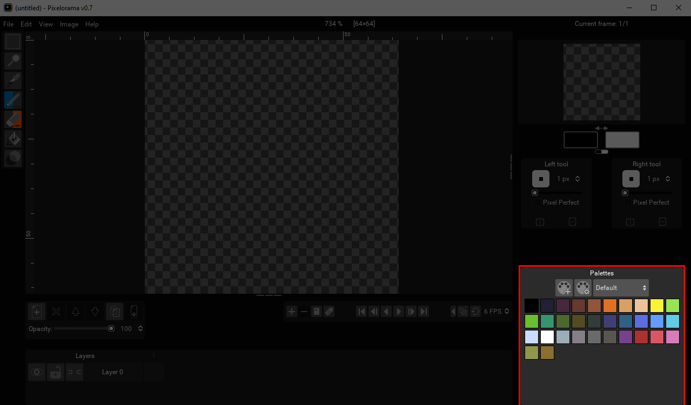

Right under the tool options, there are the palettes. There are some palette options too, and you can switch palettes.

##### The Default palette is called "Default" and this is what you see when you first open Pixelorama.

## The Grabbers

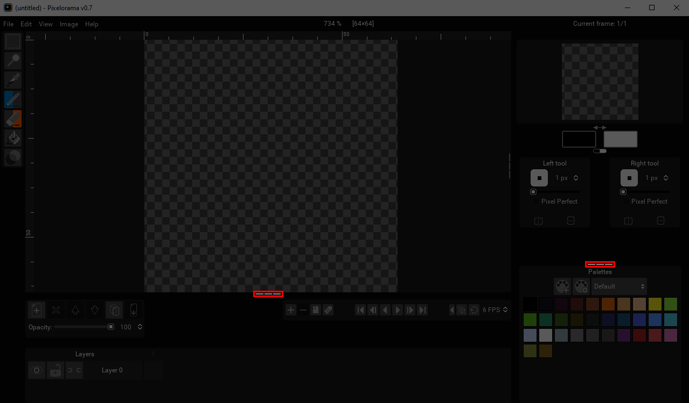

While we have already talked about the vertical grabber that is used to make another preview appear, there are 2 more, horizontal grabbers visible by default. You can click them and grab them up and down to expand the available UI if you ever need more space for the timeline or the palettes. 

### And that sums up the basics of the current User Interface of Pixelorama. Each category will be having its own documentation page where it will be analyzed in depth, but the purpose of this page was to explain what you see at a first glance when you open the program and recognise all the elements for future reference!

